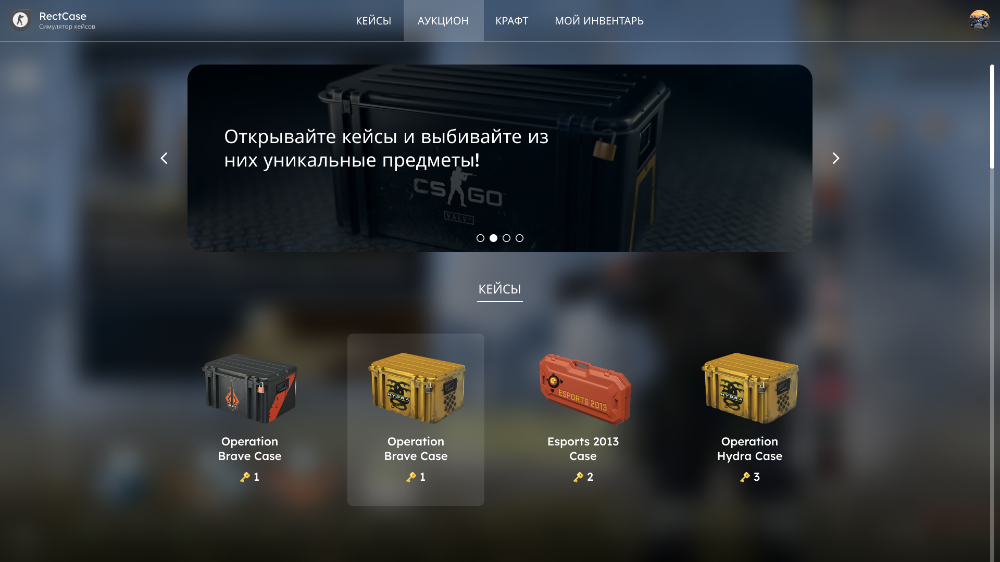

<h2 align="center">
  RectCase - Симулятор открытия кейсов CSGO
   
  <!-- <a href="https://soumyajit.vercel.app/" target="_blank">E</a> -->
</h2>

    

 

## Git Comands (Команды для принятия/отправки файлов на Git-репозиторий)

  1) git add -A
  2) git commit -m "Ваше название"
  3) git pull || git push

# Шаблон описания Update'ов 
  // Время апдейта: 02.08.2024 || 13:49  
  // Описание проделанной работы. [Например сделал запрос на сервер и вывел карточки на страницу]

   

# Update-лист
